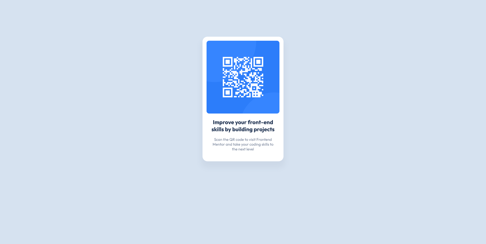

# Frontend Mentor - QR code component solution

This is a solution to the [QR code component challenge on Frontend Mentor](https://www.frontendmentor.io/challenges/qr-code-component-iux_sIO_H).

## Table of contents

- [Overview](#overview)
  - [Screenshot](#screenshot)
  - [Links](#links)
- [My process](#my-process)
  - [Built with](#built-with)
  - [Workflow](#workflow)
  - [What I learned](#what-i-learned)
  - [Continued development](#continued-development)
  - [Useful resources](#useful-resources)
- [Author](#author)
- [Acknowledgments](#acknowledgments)

## Overview

### Screenshot



### Links

- Solution URL: [Add solution URL here](https://your-solution-url.com)
- Live Site URL: [Add live site URL here](https://your-live-site-url.com)

## My process

### Workflow

- Create the skeleton of the Html page like Main, H1, and other Html Tags
- Use Chrome Developer tools to design mobile-first
- Add CSS styles based on the styled-guide.md file
- Check styles with Perfect Pixel Chrome Extension
- Create styles for Desktop viewport 
- Refine styles 


### Built with

- Grammarly app for git commits and comments correctness
- Mobile-first workflow
- CSS custom properties
- Flexbox (we can omit flexbox in this solution)


### What I learned

1. It seems irrelevant, but I used the Grammarly app for the first time to improve my Git commits and comments on this challenge. And I think for other tasks that I have I use it too Because I learned that Git commits and commands must show their meaning correctly.

2. How to use Css custom properties (variables)

```CSS
:root {
  --paragraph-color: #7b879d;
}

.paragraph {
    color: var(--paragraph-color);
}
```
3. I learned how to work with [Perfect Pixel Chrome Extension](https://chrome.google.com/webstore/detail/perfectpixel-by-welldonec/dkaagdgjmgdmbnecmcefdhjekcoceebi?hl=en)

4. [Some Markdown code](https://www.markdownguide.org/)

5. A little bit about vw, vh, vmin, vmax and also CSS layout like Flexbox

### Continued development

I need more work on [CSS layout](https://developer.mozilla.org/en-US/docs/Learn/CSS/CSS_layout/Flexbox) and [CSS values and units](https://developer.mozilla.org/en-US/docs/Learn/CSS/Building_blocks/Values_and_units)

### Useful resources

- [CSS custom properties](https://developer.mozilla.org/en-US/docs/Web/CSS/Using_CSS_custom_properties) - Great for reusing specific values throughout a document

- [Flexbox](https://developer.mozilla.org/en-US/docs/Learn/CSS/CSS_layout/Flexbox) - To lay out an Html file

- [Box-sizing](https://www.w3schools.com/css/css3_box-sizing.asp) - It specifies whether the padding and border properties of a tag reflect the size of the tag or not.

## Author

- Frontend Mentor - [@siavhnz](https://www.frontendmentor.io/profile/siavhnz)

## Acknowledgments

Special Thank To:

[Frontendmentor.io](https://www.frontendmentor.io/challenges) for their Excitement challenges  

[Perfect Pixel](https://chrome.google.com/webstore/detail/perfectpixel-by-welldonec/dkaagdgjmgdmbnecmcefdhjekcoceebi?hl=en) for such a great extension

[Minim youtube channel](https://www.youtube.com/watch?v=waiZqfefo14) for good stuff about css like vw value 
