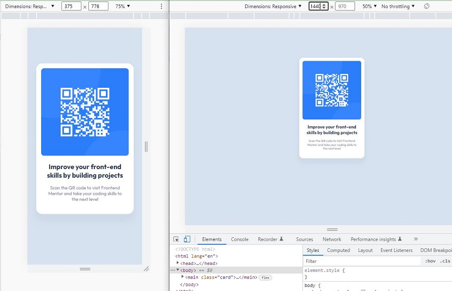

# Frontend Mentor - QR code component solution

This is a solution to the [QR code component challenge on Frontend Mentor](https://www.frontendmentor.io/challenges/qr-code-component-iux_sIO_H){:target="_blank" rel="noopener"}.

## Table of contents

- [Overview](#overview)
  - [Screenshot](#screenshot)
  - [Links](#links)
- [My process](#my-process)
  - [Built with](#built-with)
  - [Workflow](#workflow)
  - [What I learned](#what-i-learned)
  - [Continued development](#continued-development)
  - [Useful resources](#useful-resources)
- [Author](#author)
- [Acknowledgments](#acknowledgments)

## Overview

### Screenshot



### Links

- Solution: [frontendmentor.io](https://www.frontendmentor.io/solutions/mobilefirst-responsive-card-using-media-query--Srtj3P02H){:target="_blank"}
- Live Site: [github.io](https://siavhnz.github.io/frontendmentor/1.qrcode/index.html){:target="_blank"}

## My process

### Workflow

- Create the skeleton of the Html page like Main, H1, and other Html Tags
- Use Chrome Developer tools to design mobile-first
- Add CSS styles based on the styled-guide.md file
- Check styles with Perfect Pixel Chrome Extension
- Create styles for Desktop viewport and test it
- Refine styles 


### Built with

- Mobile-first workflow
- CSS custom properties
- Flexbox
- Relative values
- Grammarly app for git commits and comments correctness


### What I learned

1. How to use Css custom properties (variables)

```CSS
:root {
  --paragraph-color: #7b879d;
}

.paragraph {
    color: var(--paragraph-color);
}
```
2. I learned how to work with [Perfect Pixel Chrome Extension](https://chrome.google.com/webstore/detail/perfectpixel-by-welldonec/dkaagdgjmgdmbnecmcefdhjekcoceebi?hl=en){:target="_blank"}

3. A little bit about vw, vh, vmin, vmax and also CSS layout like Flexbox

4. [Some Markdown code](https://www.markdownguide.org/){:target="_blank"}

5. It seems irrelevant, but I used the Grammarly app for the first time to improve my Git commits and comments on this challenge. And I think for other tasks that I have I use it too Because I learned that Git commits and commands must show their meaning correctly.

### Continued development

I need more work on [CSS layout](https://developer.mozilla.org/en-US/docs/Learn/CSS/CSS_layout/Flexbox){:target="_blank"} and [CSS values and units](https://developer.mozilla.org/en-US/docs/Learn/CSS/Building_blocks/Values_and_units){:target="_blank"}

### Useful resources

- [CSS custom properties](https://developer.mozilla.org/en-US/docs/Web/CSS/Using_CSS_custom_properties){:target="_blank"} - Great for reusing specific values throughout a document

- [Flexbox](https://developer.mozilla.org/en-US/docs/Learn/CSS/CSS_layout/Flexbox){:target="_blank"} - To lay out an Html file

- [Box-sizing](https://www.w3schools.com/css/css3_box-sizing.asp){:target="_blank"} - It specifies whether the padding and border properties of a tag reflect the size of the tag or not.

## Author

- Frontend Mentor - [@siavhnz](https://www.frontendmentor.io/profile/siavhnz){:target="_blank"}

## Acknowledgments

Special Thank To:

[Dear Lucas](https://www.frontendmentor.io/profile/correlucas){:target="_blank"} for his great feedback on my first solution

[Frontendmentor.io](https://www.frontendmentor.io/challenges){:target="_blank"} for their Excitement challenges  

[Perfect Pixel](https://chrome.google.com/webstore/detail/perfectpixel-by-welldonec/dkaagdgjmgdmbnecmcefdhjekcoceebi?hl=en){:target="_blank"} for such a great extension

[Minim youtube channel](https://www.youtube.com/watch?v=waiZqfefo14){:target="_blank"} for good stuff about css like vw value 

